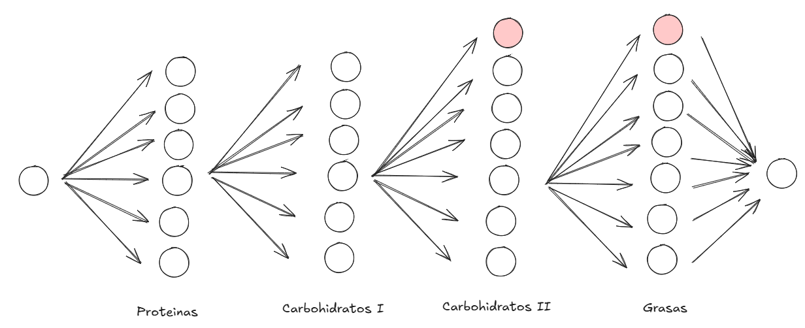
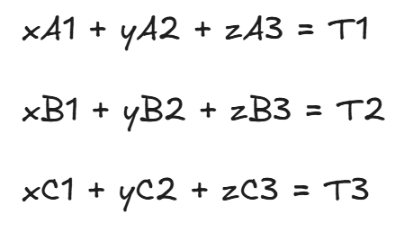

# Proyecto: Fitia Challenge 2025

## Tecnologías Utilizadas

### Frontend
- **React con TypeScript**: Se seleccionó debido a su modularidad, eficiencia en el desarrollo de interfaces y la robustez que TypeScript proporciona al manejar tipado estático, reduciendo errores en tiempo de ejecución.

### Backend
- **Node.js 22 con TypeScript**: Se utilizó por su eficiencia en el manejo de solicitudes asíncronas y su compatibilidad con Google Cloud Functions.
- **Google Cloud Functions**: Elegida para el backend debido a su escalabilidad automática y facilidad de despliegue sin necesidad de gestionar servidores.

### Hosting
- **Netlify**: Escogido para el frontend por su facilidad de despliegue continuo, integración con Git y optimización para aplicaciones React.
- **Google Cloud Functions**: Permite manejar el backend de forma eficiente sin requerir infraestructura adicional.

## Descripción del Algoritmo

El algoritmo de creacion de planes de divide en 2 partes:

### Plan Base

Con este paso buscamos crear un conjunto de alimentos. Esto es fundamental para asegurarnos la variedad de los planes y conseguir planes diferentes en cada request



Aca se muestran las configuraciones posibles en nuestro dominio de cominidad.

Donde cada camino desde el nodo source hasta el nodo target son configuraciones unicas. Y estos nodos rojos significan comidas nulas, haciendo referencia al caso de usar solo un carbohidrato o 0 grasas.

### Busqueda de Pesos

#### Modelacion 
Esta fue sin duda la parte mas divertida del problema. Se basa en contrar la cantidad de gramos necesarios en cada comida para acercarnos a nuestros objetivos.

En primer lugar, debemos partir de la idea: "Yo puedo generar un plan valido de ciertos requerimientos con cualquier plan base"

Para validad esta hipotesis debemos modelar nuestro modelo de pesos como una ecuacion lineal.



Tenemos en cuenta que las variables x , y, z representan la cantidad de gramos por comida y las constantes A las proteinas, las constantes B los carbohidratos y las constantes C las grasas.

#### Probabilidades a nuestro favor

Bajo esta perpectiva notamos que para hallar los pesos mas cercanos a nuestor objetivo T, debemos encontrar el minimo aumento que me permite la ecuacion, la cual es igual al maximo comun divisor de las constantes.

Por lo tanto, mientras mas alimentos tenga nuestro plan base, podemos asgurar integramente una solucion existente. No se descarta la idea que existe un plan de 2 alimentos cuyo maximo comun divisor no encaje en nuestro limites de 0.8 <= x  <= 1.1

Gracias a pruebas internas se tiene como dato que el algoritmo (por la poca cantidad de alimentos en la base de datos dada), falla el 66% de las veces. Dandonos un plan nulo o inexistente.

Sin embargo, este dato puede ser modelado como una propabilidad compuesta. La cual nos permite decir, cuantas veces debo equivocarme para que la probabilidad sea minima. Entonces 0.66^12 = 0 .00683167545. Por lo tanto, en 12 intentos aseguramos que el algoritmo tiene 0.6% probabilidades de fallar.

#### Eficiencia del algoritmo

La ultima cuestion a analizar es el dominio de todos los pesos posibles. Los cuales al variar segun su sizeIntervals, podemos rehalizar un busqueda completa. Dandolos el lujo de comparar todas las posibles soluciones con una complejidad estimada de
 $$ ((calorias - minPortion) / sizeInterval) ^ 4 / 4$$
y optimizaciones logramos realizar alrededor de 100 request por segundo.

#### Preferencias de usuarios

Un usuario no informado puede intentar crear planes imposibles de conseguir. Por lo tanto, debemos considerar la opcion de preferencias, donde intentar encontrar la confiruacion que mas que acerce a nuestro objetivo. Esto es posible con una funcion que calcule la distancia de nuestra configuracion actual, a una configuracion deseada. 

Este calculo puede darse a traves de tecnicas simples como distancia euclideana y alterando la percepcion de los ejes del plano. Donde a traves de funciones de "prioridad", podemos hacer que nuestro eje de proteinas sume mas puntos al acortar ditancias.

De esta manera, logramos mejores configuracion y evitamos los casos bases donde los usuarios no dominen una configuracion ideal.


## Características y Funcionalidades
- Creacion de planes de comidad a traves de interfaz interactiva
- Añadir preferencias de usuarios respecto a ciertos macronutrientes.
- Configurarion basicas y avanzados para todo tipo de usuarios.
- Planes de comidad variados en cada request
- 

## Instrucciones para Ejecutar el Proyecto


## Link del Proyecto
Link del proyecto FrontEnd:

https://fitia-challenge.netlify.app/

Link del proyecto BackendÑ

https://us-central1-fitia-challenge.cloudfunctions.net/fitia-challenge-api/getPlan

Ejemplo del body del request

```sh
{
  "mealType" : "lunch",
  "nutrientsTargets" : [
    {
      "name": "calories",
      "limit" : 495,
      "strictMode" : false,
      "priority" : "high"
    },
    {
      "name": "proteins",
      "limit" : 50,
      "strictMode" : false,
      "priority" : "medium"
    },
    {
      "name": "carbs",
      "limit" :100,
      "strictMode" : false,
      "priority" : "low"
    },
    {
      "name": "fats",
      "limit" : 20,
      "strictMode" : false,
      "priority" : "low"
    }
    
  ]
  
}
```

Descripcion:

- Name: Nombre del macronutriente
- limit: Aproximacion deseada
- strictMode: El intervalo 0.8 <=x <= 1.1 debe ser respetado obligatoriamente
- priotiry: Nivel prioridad en la eleccion de los pesos


## Local

### Requisitos Previos
- Node.js 22 o superior
- NPM o Yarn
- Cuenta en Google Cloud (si deseas desplegar el backend)

### Instalación
1. Clonar el repositorio:
   ```sh
   git clone https://github.com/sebasvp2005/Fitia-Challenge
   cd https://github.com/sebasvp2005/Fitia-Challenge
   ```
2. Instalar dependencias:
   ```sh
   cd Frontend
   npm install
   cd ../Backend
   npm install
   ```

### Ejecución en Desarrollo
#### Frontend:
```sh
cd Frontend
npm run dev
```

#### Backend:
```sh
cd Backend
npm run start
```

### Despliegue
- **Frontend**: Se despliega automáticamente en Netlify al hacer push a la rama principal.
- **Backend**: Se despliega en Google Cloud Functions mediante el siguiente comando:
  ```sh
   gcloud functions deploy fitia-challenge-api  --runtime=nodejs22  --trigger-http   --entry-point=fitia-challenge-api --region=us-central1
  ```

## Hosting y Justificación
- **Frontend en Netlify**: Se eligió por su rapidez en el despliegue y soporte para aplicaciones React.
- **Backend en Google Cloud Functions**: Proporciona escalabilidad automática y menor costo en comparación con servidores tradicionales.

